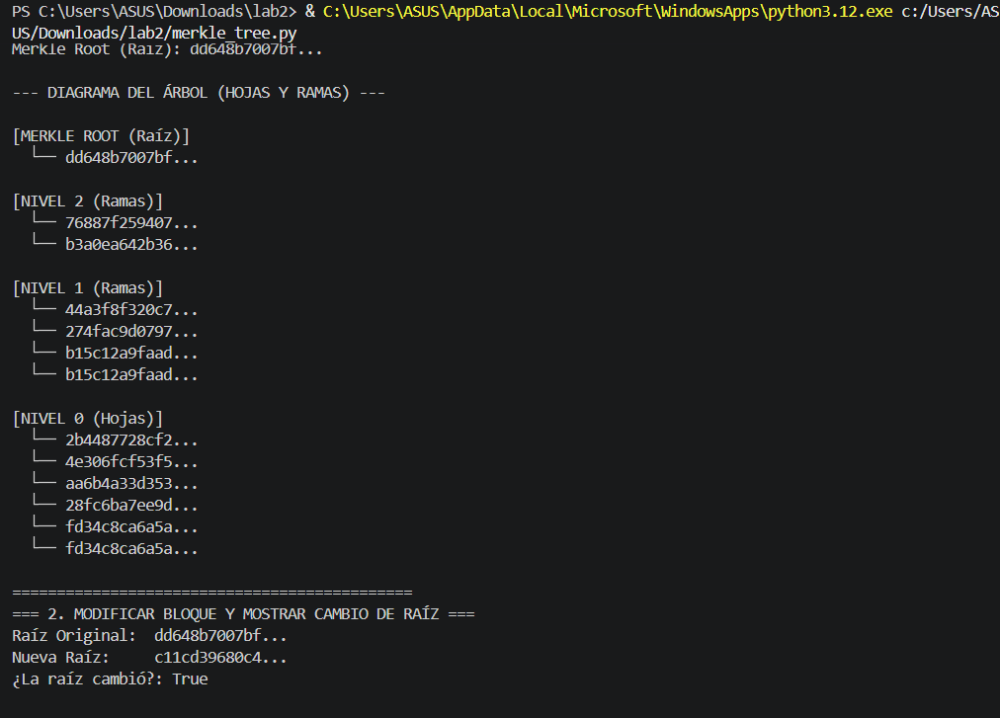
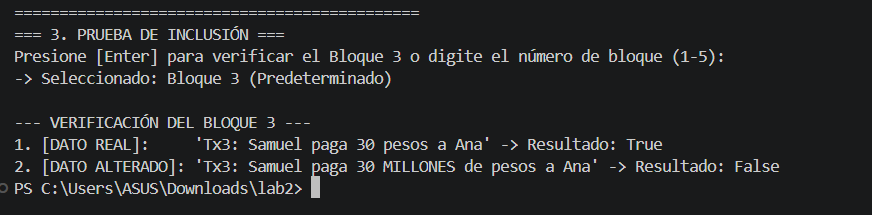
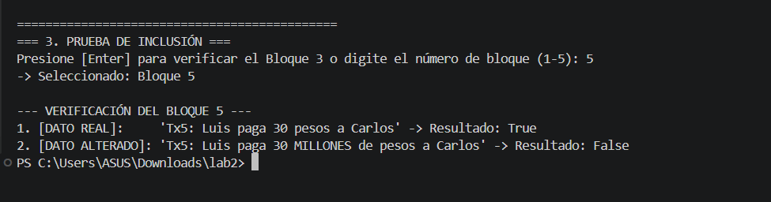

# Implementación de Árbol de Merkle (Merkle Tree) en Python

> **Declaración de Código de Honor / Uso de IA:**  
> Este código fue desarrollado con el apoyo de Inteligencia Artificial (Gemini, OpenIA) como herramienta de asistencia para el diseño de arquitectura, optimización de algoritmos y depuración. Pruebas y conceptos expuestos han sido revisados por mi. 

---

## Descripción del Proyecto

Este proyecto contiene una implementación funcional en Python de un **Árbol de Merkle** (Merkle Tree). La estructura permite verificar la integridad de un conjunto de datos (transacciones simuladas) y demostrar de forma eficiente la pertenencia de un elemento mediante **pruebas de inclusión (Merkle Proofs)** sin necesidad de exponer la totalidad del árbol.

---

## Tecnologías y Conceptos Utilizados

* **Lenguaje:** Python 3
* **Criptografía:** Módulo nativo `hashlib` utilizando el algoritmo **SHA-256**.
* **Programación Orientada a Objetos:** Clase `ArbolMerkle` encargada de la construcción del árbol, la generación de la prueba criptográfica y la verificación.
* **Formato Visual:** Hashes truncados a 12 caracteres en consola para una lectura clara del diagrama.

---

## Planteamiento de la Solución

1. **Construcción del Árbol (Bottom-Up):**
   * **Hojas (Nivel 0):** Se calcula el Hash SHA-256 de cada uno de los 5 bloques originales.
   * **Ramas (Nodos Internos):** Se procesan de 2 en 2, concatenando sus hashes (`SHA-256(Hijo_Izq + Hijo_Der)`) hasta obtener un único hash.
   * **Merkle Root (Raíz):** El hash resultante en el nivel superior que representa el estado global de todos los datos.

2. **Manejo de Bloques Impares:**
   * Al procesar **5 bloques** (cantidad impar), el último nodo (`Tx5`) no tiene pareja.
   * **Solución:** El profe nos planteo que hay que duplicar automáticamente el último nodo en el nivel correspondiente para mantener la paridad estructural. En el código resalte esta parte explícitamente esta acción en la consola como `[DUPLICADO PARA PAREJA PAR]`.

3. **Prueba de Inclusión Dinámica (Merkle Proof):**
   * Se recopilan los nodos hermanos (*siblings*) necesarios a lo largo del camino del árbol hacia la raíz.
   * La verificación reconstruye el camino Hash combinando el dato entregado con los hermanos. Si el resultado final coincide con la **Merkle Root**, el dato es auténtico (`True`); si difiere, es rechazado (`False`).

---

## Experimento e Interacción

Al ejecutar `merkle_tree.py`:
1. Muestra la **Merkle Root** original y el **Diagrama del Árbol**.
2. Altera el Bloque 1 para demostrar el **Efecto Avalancha** (la raíz cambia por completo).
3. Permite presionar **Enter** para verificar el **Bloque 3** (predeterminado de la guía) o digitar el número de cualquier otro bloque (1 al 5).Por si quiere hacer pruebas con otro bloque diferente al bloque pedido en el laboratorio.
4. Corre de forma automática:
   * **Prueba con dato real** → Retorna `True`.
   * **Prueba con dato alterado** → Retorna `False`.

---

##  Evidencias de Ejecución

---
